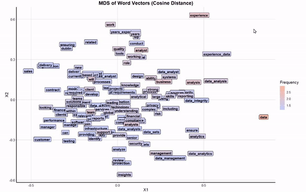
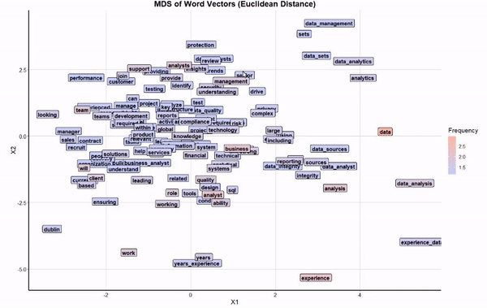

# Euclidean vs Cosine for MDS

The reason is because of their presentation. 

We were Cosine better for the similarity analysis since we want to know the distance as close as possible. But in the plot, this will be a pitfal for a reader. 
Since the words are crossover one another more often rather than the Euclidean distance. 

On the other hand, Euclidean shows a better presentation.

