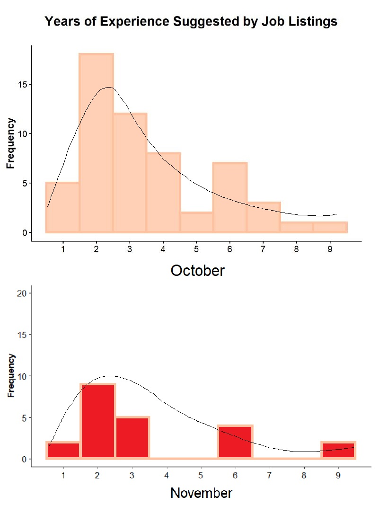
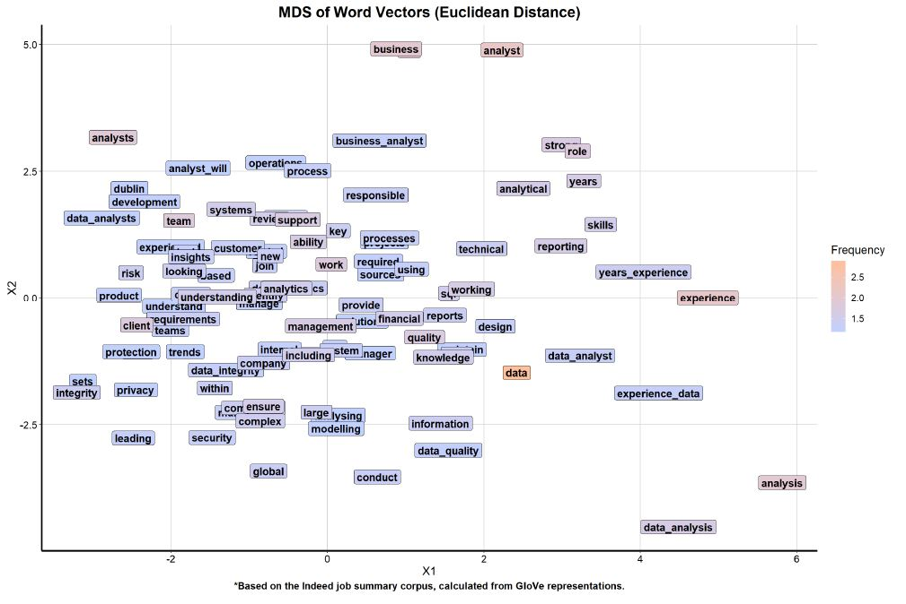

# Automated Keyword Extraction of Data Analyst Job Descriptions from Indeed using NLP

### Introduction 

I was a business analyst in the bank and I have been thinking about how we can make a better business decision based on the data. In 2019, I had an opportunity to continue my masters in data and computational science. Then in September, my job-seeking journey started. In reviewing various job descriptions of a data analyst from LinkedIn, Indeed and Glassdoor; 
I found myself questioning about: 

>***"what is a data analyst doing?"***

>***"what is the KEYWORDS of the job summaries?***

In order to answer these questions, I used natural language processing (NLP) techniques to analyze the keywords in job summary for a data analyst. 

### About the Data Set

*How we Get the Data Set from Indeed?*

We will do a simple scrape with rvest.

This is the preview of my first indeed page:

Okay, here is the section where we should tailoring the url. Since, I am looking for the data analyst position in Ireland, I used ie.indeed and "Data analyst" keyword which gave me this link:<https://ie.indeed.com/jobs?q=Data+Analyst> as my first page result. 

**Step 1.** My first page link

**Step 2.** After installing selector gadget, it will show up on your chrome addins

**Step 3.** Selecting the area that you want

**Step 4.** Copy the ".summary" for your html_nodes

So, I detected the pattern on indeed's link page which is not ended by 1,2,3, ...
It is the multiplication of 10. Here is the loop code for that condition:

Next, I only have an interest to find a job in Dublin. Then I subset the data with unique location = Dublin. 

## Exploratory Data Analysis & Preprocessing

I will use the a basic NLP technique that constructs features based on term frequencies. I made use of these features to train the classifier given a collection of texts, known as a *corpus*. 

The summary of a job description will list the number of years of experience desired. We will see how the years of experience were distributed in Dublin data set. 

Compare to the October results, 
# note here

Here is the count of top 10 most frequent words:

### Bag of Words Visualization

Before proceeding to classification, I visualized term frequencies and associations. First, I produced word clouds that depicted the 200 most frequent terms weighted by their frequency:

Oct 

Nov

Some of the terms represent stemmed versions of proper English words (i.e. **experi** instead of **experience**). **Data** and **analyst** were the most frequent terms in the overall corpus. 

I stored the information scraped from Indeed onto a data frame. I also plotted the years of experience for the numeric values in the scraped job summaries to compare against the presampled qualifications corpus from Part 1. Finally, I transformed the corpus by removing stopwords, punctuation, and numbers, and converted it to lowercase. 

### Vectorization of Job Summary Corpus using GloVe Algorithm
The *bag-of-words* approach has a pitfall, it is a quick but dirty scheme to capture the keywords available. It does not always capture the meaning in the appropriate context. 

I applied the GloVe algorithm, into the job summary corpus, examining both unigrams (single terms) and bigrams (pair of consecutive terms). 

tell more about unigram and bigram(s)

### Plot GloVe Word Vectors using Multidimensional Scaling

MDS seeks to preserve the distance between vectors. Since vector distances within GloVe encode some semantic meaning, it would be ideal to preserve the relative term topology. We applied MDS with Euclidean distances between these word vectors.  

Explain the color meaning

I expected terms close to each other in this reduced vector space to be semantically similar, meaning they are commonly found within the same context and are transposable within the corpus. There are some clear and evident trends from this figure:

1.  The terms seem to be stratified primarily by frequency. 
- Higher frequency terms are more separated and isolated. These terms can be properly contextualized and placed within the multidimensional space in a location that reflects its unique meaning. 
- Low frequency terms tend to aggregate around each other, often overlapping. These terms cannot be determined as precisely, so their encodings tended to settle closely to each other without much differentiation. 

more...

## Conclusions

> revise here - Semantic distinction is a function of term frequency. 

GloVe provides a distributed word representation model that learns context iteratively. Terms that are synonymous with each other within corpora can be easily identified and targeted for further analysis. GloVe trains relatively fast on small data set, so I could scale the algorithm to larger corpora that takes advantage of more nuanced job descriptions. MDS can reveal groupings of words into broader subject areas that highlight the inherent disparities of word embeddings. I would look to expand this analysis to peripherally related jobs, like data scientist and data engineer. Possible extensions include topic modeling, document summarization, and possibly, resume matching with prospective job descriptions.  
