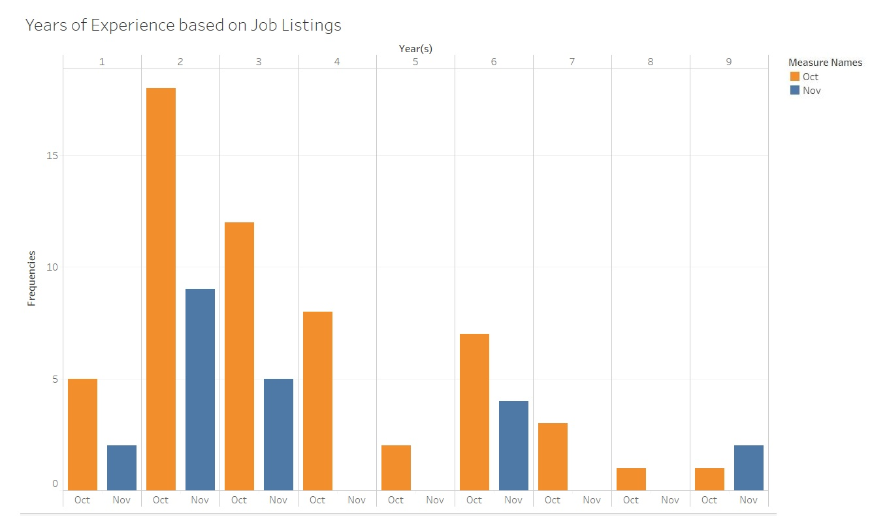
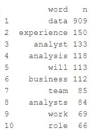
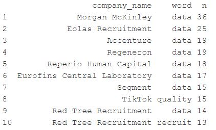
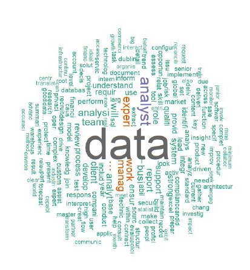
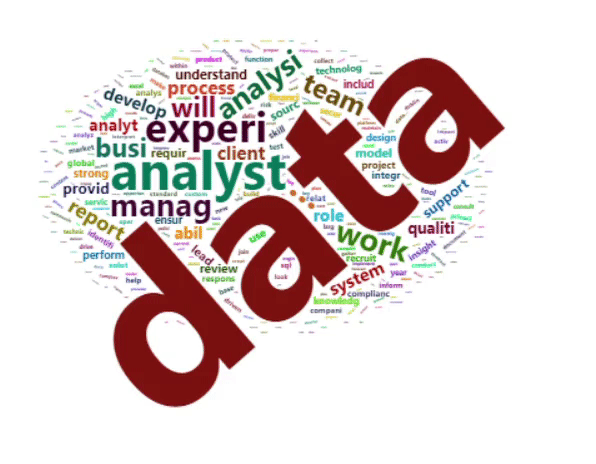
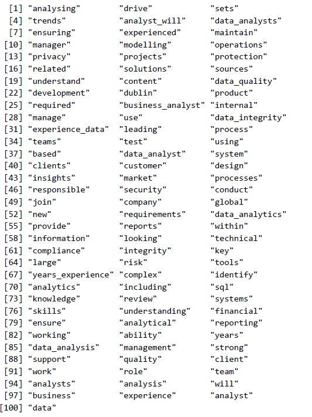
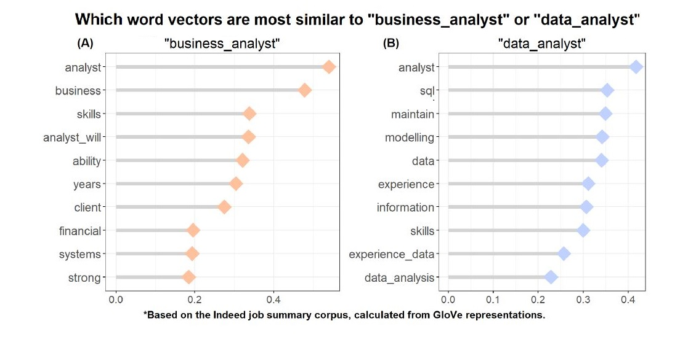
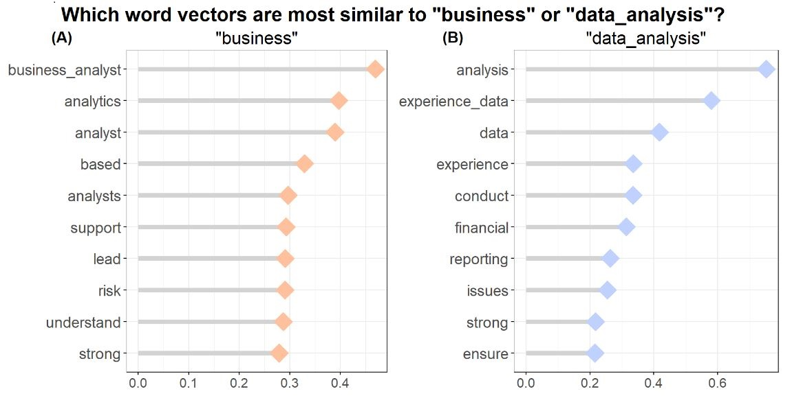
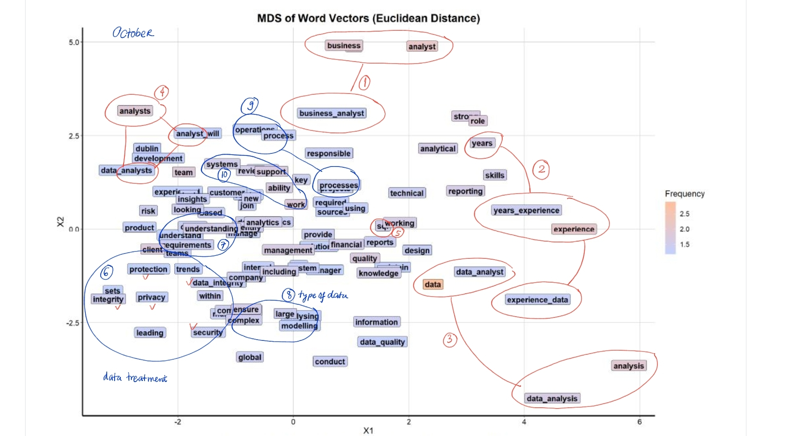
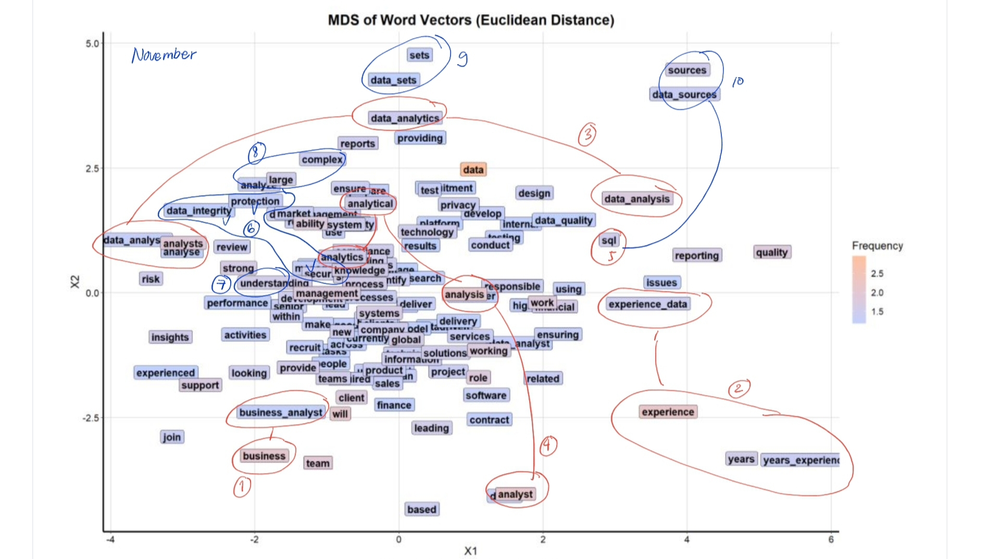

# Automated Keywords Extraction of Data Analyst Job Descriptions from Indeed using NLP

### Introduction 

I was a business analyst and I have been thinking about how we can make a better business decision based on the data. In 2019, I started my masters in data and computational science. Then in September 2020, my job-seeking journey started. 

In reviewing various job descriptions of a data analyst from LinkedIn, Indeed and Glassdoor; 
I found myself questioning about: 

>***"how many years of experience that I need?"***

>***"what are the KEYWORDS of a data analyst job summary?***

In order to answer these questions, I used natural language processing (NLP) techniques and GloVe Algorithm to analyze the keywords in job summaries/description (I will use both interchangeably) for a data analyst. 

### About the Data Set
We will **get** the datas set from Indeed. I decided to use Indeed because it has a straight-forward structure and it is the best job search website in Ireland.

You can check this link: <https://www.betterteam.com/job-posting-sites-ireland> for 2020 version. 

*How we Get the Data Set from Indeed?*

We will do a simple scrape with *rvest* library with R. 
This is the preview of my first indeed page:

Okay, here is the section where we should tailoring the url. Since, I am looking for the data analyst position in Ireland, I used ie.indeed and "Data analyst" keyword which gave me this link:<https://ie.indeed.com/jobs?q=Data+Analyst> as my first page result. 

**Step 1.** My first page link

**Step 2.** After installing selector gadget, it will show up on your chrome addins

**Step 3.** Selecting the area that you want

**Step 4.** Copy the ".summary" for your html_nodes code.

Full technical explanation is inside the R code. 

The whole project in brief, I detected the pattern on indeed's link pages, scraped all of the informations, stored the them onto a data frame and grouped the data with Dublin location since I have an interest to analyze the job summaries in Dublin, Ireland.  I also plotted the years of experience for the numeric values in the scraped job summaries. Finally, I transformed the corpus by removing stopwords, punctuation, and numbers, and converted it to lowercase as the preprocessing process before I applied GloVe Algorithm into the data set. 

## Exploratory Data Analysis & Preprocessing

I will use the a basic NLP technique (bag of words) that constructs features based on term/word (I will use both interchangeably) frequencies. I made use of these features to train the classifier given a collection of texts, known as a *corpus*. 

To answer the first question **"how many years of experience that I need?"**, we will see how the years of experience were distributed in Dublin data set. Most of the time, the summary will list the number of years of experience desired. I scraped the websites on October and November 2020.

From the plots, it is clear that the number of job postings are decreasing since the companies are slowing down by the end of year. But most of data analyst positions need the candidates with two or three years of experience. The distributions of Oct and Nov are both skewed left distributions. 

Now, let's see the top 10 most frequent words from November Data Set:

Word "data" on the first place follows by "experience", if we accumulate all words contain "analys" we will have it on the second place. Which make senses since this is a job description for "data analyst" position. We can ignore "will" and we can conclude that based on the frequent words: **to become a data analyst, you should have experience**.

Let's take a look about the company. Based on the data, the top three companies are recruitment agencies in Ireland. 
The companies listed below have many job listings with word "data" in it. 

### Bag of Words Visualization

Before proceeding to classification, I visualized term frequencies and associations. First, I produced word clouds that depicted the 200 most frequent terms weighted by their frequency.

**Wordcloud of October Data Set**

**Wordcloud of November Data Set**

**Data** and **analyst** were the most frequent terms in the overall corpus of both data set. We notice that some of the terms represent stemmed versions of proper English words (i.e. **experi** instead of **experience**). We can see a similar visualization of both wordclouds. 

### Vectorization of Job Summary Corpus using GloVe Algorithm
The *bag-of-words* approach has a pitfall, it is a quick but dirty scheme to capture the keywords available. It does not always capture the meaning in the appropriate context. That is the main reason that I applied the GloVe algorithm into the job summary corpus, examining both single terms and also pair of consecutive terms (uni and bi-grams). 
The example of unigram is "analyst" while the example of bigram is "data_analyst". We will explore more about them in this section. 

This is the job summary corpus based on October data set. 

There are 135 terms and we have more technical terms in the job summary based on November data set compare to the previous data set.

The plots below show the similarity analysis for both data set. 

### Plot GloVe Word Vectors using Multidimensional Scaling

Plot a vector with 100 dimensions would not be informative, thus we used Multidimensional Scaling (MDS) to ease the interpretation. MDS seeks to preserve the distance between vectors. Since vector distances within GloVe encode some semantic meaning, it would be ideal to preserve the relative term topology. We applied MDS with Euclidean distances between these word vectors.  

> Semantic distinction is a function of term frequency. 

GloVe gives a distributed word representation model that learns context iteratively. The synonymous terms in corpora can be easily identified for further analysis. It trains relatively fast on small data set and longer as the data set getting larger or more complex. This techniques uncovers groupings of words into broader subject areas that highlight the inherent disparities of word embeddings.

***What we got from the visualization?***

We can answer the second question: "what are the KEYWORDS of a data analyst job summary?"

I expected terms close to each other in this reduced vector space to be semantically similar, meaning they are commonly found within the same context and are transposable within the corpus. There are some clear and evident trend from the figures: ***The terms seem to be stratified primarily by frequency.***

Where: 
- Higher frequency terms are more separated and isolated. These terms be placed within the multidimensional space in a location that depicts its distinct meaning. 
- Low frequency terms tend to aggregate around each other, often overlapping to show how close they are. These terms cannot be determined as precisely, so their encodings tended to settle closely to each other without much differentiation. Sometimes we 'could not' find them. 

After further analysis with the distance of terms in MDS figures, I conclude top ten insights. 

1. **business, analyst and business_analyst** are important as a data analyst, (sometimes) as a driver of business, a data analyst should understand about the business analysis.
2. **years, experience and years_experience** are vital in job description of a data analyst. 
3. **data, analysis, data_analyst and data_analysis** follows by number 4 **analysts, data_analysts and analyst_will*
5. **SQL** is one of programming language to get data. A *must* have to become a data analyst.
6. In this part, it is more about data treatment including how to protect it, compliance and security (**integrity, protection, privacy and security**)
7. **Understanding the requirement** is very important. With no understanding of goals, a data analyst would not be able to solve anything.
8. Data analyst should be able to handle **complex** and **large** data set. 

For October data set only, we have:

9. Knowledge and throughly understanding aobout **Operation Process** also nice to have. 
10. Teamwork is important, as we have the **ability** to **support** and **Work** in **team**

For November data set, we have examples of distinct or unique terms such as:

9. **data_sets** and **sets** 
10.  **source** and **data_sources** (which closer to SQL)

## Conclusions

Based on the Indeed Job Summary Corpus:

>***A data analyst needs 2-3 years of experience***

>***The KEYWORDS: business, analyst, business_analyst, years, experience, years_experience, data, analysis, data_analyst, data_analysis, analysts, data_analysts, analyst_will, SQL, source, data_sources, integrity, protection, privacy, security, understand, requirement, complex, large, data_sets, sets, operation, process
ability, support, work, team.***

I would recommend to extent the analysis to related jobs, like data scientist and data engineer. Possible extensions include topic modeling, or maybe resume matching with prospective job descriptions.
